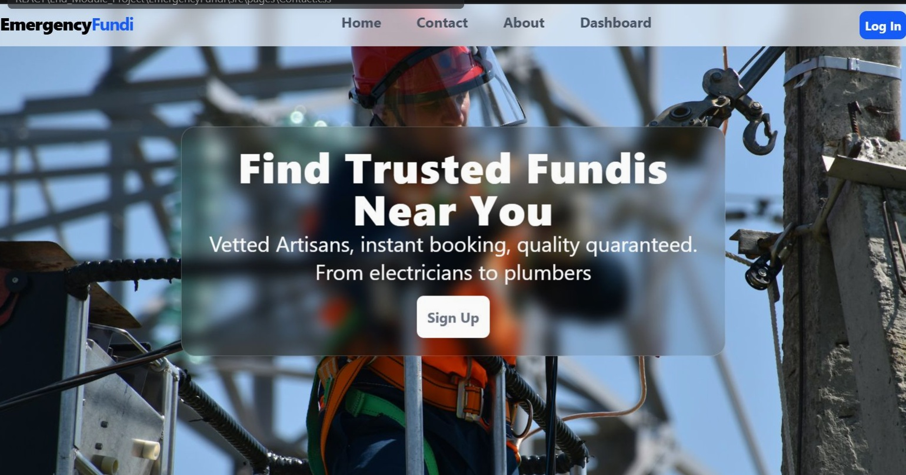

# EmergencyFundi

## 1. Project Brief

The **EmergencyFundi** application is a modern, responsive platform designed to seamlessly connect clients with local, vetted artisans (fundis) such as plumbers, electricians, carpenters, and painters. It provides an intuitive interface to search, filter, and view reliable service providers in real-time.

## 2. Business Rationale

In an emergency-response marketplace, quick access and trust are essential. This project addresses two primary business needs:

* **Brand Authority:** A clean, glassmorphic layout establishes trust, reassuring clients that they are engaging with a professional and secure platform.
* **Data Accessibility:** Efficient search bar filtering and structured cards ensure clients quickly find fundis based on category, location, or name without unnecessary friction.

## 3. Technologies used

* **React (JSX):** Component-based UI architecture built with Vite for fast rendering and state management.
* **Tailwind CSS & CSS3:** Responsive layout designs utilizing `backdrop-filter`, glassmorphism, and responsive grid layouts.
* **JSON-Server:** Lightweight REST API mock server for managing dynamic fundi and booking data.
* **Git/GitHub:** Version control and feature-based branch management.

## 4. Accessibility features

* **Semantic HTML:** Constructed using proper `<nav>`, `<main>`, `<section>`, and `<button>` tags for improved screen-reader navigation.
* **Responsive Breakpoints:** Adaptive layout structures using CSS Grid (`grid-cols-1 sm:grid-cols-2 lg:grid-cols-3`) to prevent horizontal overflow across screen sizes.
* **Input Clarity:** Explicit labels, high-contrast text, and clear placeholders ensure easy search interaction.

## 5. Product features

* **Dynamic Search & Filtering:** Instant live filtering by artisan name, category (e.g., Plumbing, Electrical), or location.
* **Fixed Navigation Bar:** A sticky top navigation bar with `backdrop-blur-md` for quick layout navigation.
* **Artisan Detail Modal:** Interactive pop-up overlay providing deeper view details for selected service providers.
* **Dashboard Layout:** Structured sidebar and workspace for client profile and category overview.

## 6. Git workflow

* **Fork the Repository:** Create your own copy of the project to work on.
* **Create a Feature Branch:**

```bash
git checkout -b feature/YourFeatureName
Commit Your Changes

Push to branch:

Bash
git push origin feature/YourFeatureName
Open a Pull Request (PR): Describe your changes clearly and link the related issues.
```

## 7. Set up instructions

a. Clone this repository on your local machine:

```Bash
git clone [https://github.com/rollingsmajiwa/EmergencyFundi.git](https://github.com/rollingsmajiwa/EmergencyFundi.git)
cd EmergencyFundi
b. Install dependencies:

Bash
npm install
c. Start the mock API server:

Bash
npx json-server --watch db.json --port 3001
d. In a separate terminal, start the development app:

Bash
npm run dev
```
## 8. Screenshots


## 9. Author
Rollings Majiwa

* **GitHub:** [https://github.com/rollingsmajiwa](https://github.com/rollingsmajiwa)

* **Email:** [rollingsmajiwa@gmail.com](mailto:rollingsmajiwa@gmail.com)

## 10. Get started
Interested in the code behind EmergencyFundi? You can reach me directly via my profile or open an issue for collaboration. Visit my GitHub profile